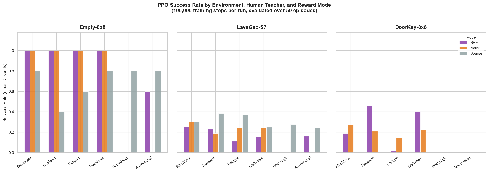

# Cross-Modal Bayesian Reward Filtering for Noisy Human Feedback

Code for the **Bayesian Reward Filter (BRF)**, a lightweight way to decide how much to trust human feedback during reinforcement learning, evaluated on MiniGrid with synthetic teachers.

**Paper:** [`paper-poster/paper.pdf`](paper-poster/paper.pdf) · **Poster (earlier, preliminary results):** [`paper-poster/poster_srop2026_preliminary.pdf`](paper-poster/poster_srop2026_preliminary.pdf) · Anika Prakash and Rohan Pandey, SROP 2026

## Idea

Human feedback is dense but can be noisy, fatigued or adversarial. The environment's sparse reward is reliable but rarely informative. BRF keeps a Beta posterior over how often the human's feedback agrees (in sign) with an environment-derived progress signal Δφ, and uses the posterior mean as a trust weight:

```
r_total = r_env + w · r_human,    w = α / (α + β)
```

Agreement increments α, disagreement increments β, and steps with Δφ = 0 are skipped (see `reward_filter/bayesian.py`).

Reward modes compared: **sparse** (w = 0), **naive** (w = 1), **ema** (exponential-moving-average trust) and **bayesian** (BRF).

## Results

Mean success rate over 5 seeds (PPO, 100,000 training steps, 50 evaluation episodes). Full data: [`results/main_run/results.csv`](results/main_run/results.csv).

| Environment | Teacher | Sparse | Naive | EMA | BRF |
|---|---|---|---|---|---|
| Empty-8x8 | StochasticLow (10% noise) | 0.80 | 1.00 | 1.00 | 1.00 |
| Empty-8x8 | Adversarial | 0.80 | 0.00 | 0.80 | 0.60 |
| DoorKey-8x8 | Realistic | 0.00 | 0.21 | 0.31 | 0.46 |
| DoorKey-8x8 | DistanceNoise | 0.00 | 0.22 | 0.32 | 0.40 |
| DoorKey-8x8 | Fatigue | 0.00 | 0.14 | 0.37 | 0.01 |
| LavaGap-S7 | StochasticLow | 0.30 | 0.30 | 0.17 | 0.25 |

- Under an adversarial teacher, naive feedback collapses to 0.00 while BRF keeps 0.60; sparse and EMA do better here (0.80).
- DoorKey is never solved by sparse reward, so human feedback is necessary. BRF is best under the Realistic and DistanceNoise teachers.
- BRF fails under the Fatigue teacher on DoorKey (0.01), consistent with the stationarity limitation discussed in the paper: a long reliable phase makes the posterior slow to react. The decaying EMA does better there (0.37).
- On LavaGap, no human-feedback mode reliably beats sparse reward; the lava-penalized potential function can conflict with the teacher's goal-directed feedback.
- At 80% noise (StochasticHigh), every human-feedback mode fails on all three environments.



## Setup

Python 3.10 or newer (developed with 3.13).

```bash
python -m venv .venv
source .venv/bin/activate        # Windows: .venv\Scripts\activate
pip install -r requirements.txt
```

## Usage

```bash
# Print the experiment matrix without training
python run_experiment.py --dry-run

# Full matrix: 1 agent x 3 envs x 4 modes x 6 teachers x 5 seeds = 360 runs
python run_experiment.py --run-name my_run

# Quick smoke test
python run_experiment.py --envs MiniGrid-Empty-8x8-v0 --modes bayesian \
    --humans StochasticLow --seeds 42 --timesteps 500 --run-name smoke

# Hyperparameter sensitivity (also: N0, magnitude)
python run_sensitivity.py --sweep w0

# Tables, significance tests and plots from saved results
python analyze_results.py --results-dir results/main_run
python analyze_results.py --sensitivity-dir results/
```

Interrupted runs resume when you re-run with the same `--run-name`. `results/main_run` is already complete, so re-running with that name skips everything. Per-run trust and loss curves (`results/*/curves/`) are not committed; `run_experiment.py` regenerates them.

## Repository layout

```
run_experiment.py     run the full experiment matrix (resumable)
run_sensitivity.py    sweeps over the prior (w0, N0) and feedback magnitude
analyze_results.py    tables, significance tests and plots from saved results
config.py             environments, reward modes, seeds, teachers, hyperparameters
reward_filter/        the method: Bayesian trust update (bayesian.py) and EMA baseline
env/                  ResearchWrapper (reward fusion) and per-environment potential functions
humans/               synthetic teachers: stochastic, adversarial, distance, fatigue, realistic
agents/               builds the Stable-Baselines3 PPO agent
training/             logging callback and evaluation
tests/                unit tests for the filters, teachers and wrapper
results/              main_run (final), sensitivity_* sweeps, archive/ (earlier experiment)
figures/              figures used in the paper
paper-poster/         paper PDF and the earlier poster
```

Run the tests with `python -m pytest`.

## Caveats

- Synthetic teachers only, a single agent family (PPO), and MiniGrid-scale tasks.
- BRF needs a hand-designed potential function φ for each environment.
- Five seeds with high variance: for example, Sparse success on LavaGap ranges from 0.00 to 1.00 across seeds within one condition, so small differences (about 0.2 or less) are not conclusive.
- Sparse results differ slightly between teacher rows even though Sparse ignores the teacher. These differences are run-to-run noise, not an effect of the teacher.

## License

MIT